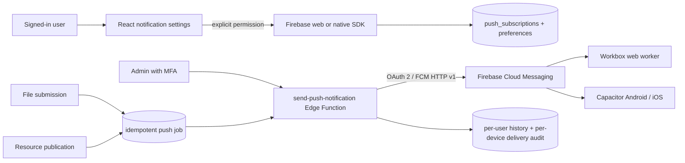

# JBC Athenaeum push notifications

## Architecture



React never sends to FCM. An authenticated, active `admin` or `super_admin` calls the Edge Function. The function uses a service account only from Supabase secrets, selects enabled and recently seen subscriptions whose account preference allows the category, and sends with a bounded concurrency of eight. Delivery logs reference subscription IDs but never copy tokens.

Workflow Edge Functions can process only their own server-created, idempotent jobs through a service-role-authenticated internal call. A contributor cannot use this path to construct or send arbitrary notifications. When a PDF submission completes, the system resolves active `super_admin` accounts server-side and sends each one a moderation alert linking to `/admin/reviews`. One history row is created per super administrator, while every enabled device receives its own delivery. The submitting contributor is excluded from the administrator alert if that account is itself a super administrator.

The private `notifications` table is the notification-center history. A campaign creates one row per eligible user, while `notification_deliveries` records one result per enabled subscription. Push uses the dedicated `push_subscriptions` table because an FCM token has different lifecycle and secrecy requirements.

## Web and PWA setup

Copy `frontend/.env.example` to a private `.env.local` and set the seven Firebase web values plus the VAPID public key. The VAPID key is created in Firebase Console → Project settings → Cloud Messaging → Web Push certificates. Replace:

```dotenv
VITE_FIREBASE_VAPID_KEY=REPLACE_WITH_FIREBASE_WEB_PUSH_PUBLIC_KEY
```

The other `VITE_FIREBASE_*` values are client identifiers, not service-account secrets. Vite emits them once to `/firebase-config.js`; source modules read the same environment. Never put `FIREBASE_CLIENT_EMAIL` or `FIREBASE_PRIVATE_KEY` in any Vite variable.

Vite/Workbox owns the only root-scoped service worker. It imports `/firebase-messaging-sw.js`; do not separately register that file. Web subscriptions receive data-only FCM messages, and this one worker calls `showNotification()`. A notification ID and tag prevent duplicate rendering. Click destinations are reduced to same-origin paths and default to `/resources`.

When the page is visible, Firebase `onMessage()` feeds the global in-app popup queue instead of creating an operating-system notification. Up to three accessible cards are visible, with additional messages queued. Foreground sound uses `/sounds/notification.mp3`, only after a user gesture and only when the user preference, category, visibility, and quiet-hours checks allow it. The service worker never plays this file.

Web code requests `silent: false`, and native payloads use the platform default sound. A website cannot force background sound: Chrome, Android, macOS, Windows, Focus mode, browser settings, channel settings, and device mute state remain authoritative.

Permission is requested only by the Enable button on the authenticated preferences page. Denied permission must be changed in browser settings; the application does not repeatedly prompt. Web push requires HTTPS (localhost is the development exception). Chromium desktop/Android, Firefox, and modern Safari have differing support. iOS web push requires iOS/iPadOS 16.4 or later and an installed Home Screen web app.

## Android

The supplied Firebase client configuration is at `frontend/android/app/google-services.json`; its package name was verified as `np.com.nirmalsanjel.jbcathenaeum`. The existing Groovy build already uses Google Services `4.4.4` and applies it conditionally when the JSON exists. Capacitor manages Firebase Messaging dependencies; no Analytics dependency was added.

Android configuration includes `POST_NOTIFICATIONS`, channel `academic_updates` (user-visible name “Academic updates”), gold accent color, and a monochrome `ic_stat_jbc_notification` status icon. The runtime creates the channel at high importance. Run:

```bash
cd frontend
npm run cap:sync
cd android
./gradlew assembleDebug
./gradlew assembleRelease
```

Test Android 13+ permission, foreground, background, terminated app, and taps on a physical device. A release build still needs the project’s real signing configuration.

## iOS and APNs

The supplied plist is at `frontend/ios/App/App/GoogleService-Info.plist` and reports bundle ID `np.com.nirmalsanjel.jbcathenaeum`. It is included in the App target and copied as a bundle resource. Capacitor 8 uses Swift Package Manager and `cap sync` adds `CapacitorPushNotifications`. That plugin exposes the native APNs token on iOS, while the FCM HTTP v1 sender requires an FCM registration token. The App target therefore has one demonstrated direct dependency on `FirebaseMessaging` 12.x plus `FcmTokenPlugin.swift`; it configures Firebase once, associates the APNs token, and passes only the resulting FCM token to React. Do not add a second Firebase initializer or another messaging wrapper.

In Xcode, select the App target and configure:

- Signing team and a provisioning profile for `np.com.nirmalsanjel.jbcathenaeum`.
- Push Notifications capability.
- Background Modes → Remote notifications.
- The correct production `aps-environment` entitlement when archiving.

In Apple Developer, create an APNs authentication key. In Firebase Console → Project settings → Cloud Messaging → Apple app configuration, upload the `.p8` key and enter its Key ID and Team ID. Values still required manually are `APPLE_TEAM_ID`, `APPLE_KEY_ID`, and the private `APNS_AUTH_KEY_FILE`. Never commit the `.p8` file. Push delivery cannot be fully validated in the iOS simulator; use a signed physical iPhone.

## Database and Edge Functions

Apply `supabase/migrations/202607200017_push_notifications.sql`, then `supabase/migrations/202607220018_notification_experience.sql`. The second migration adds foreground preferences, per-user campaign history, internal routes, owner-only history access, and unique campaign/user plus campaign/subscription delivery constraints.

Create a dedicated Google service account with only the Firebase Cloud Messaging API Admin role (`roles/firebasecloudmessaging.admin`) for project `jbc-athenaeum`. Create and download a key only in an appropriate secure operator environment, copy its client email/private key into the secret commands, then securely remove the downloaded JSON. Do not add it to this repository.

```bash
supabase secrets set FIREBASE_PROJECT_ID="jbc-athenaeum"
supabase secrets set FIREBASE_CLIENT_EMAIL="REPLACE_WITH_SERVICE_ACCOUNT_CLIENT_EMAIL"
supabase secrets set FIREBASE_PRIVATE_KEY="REPLACE_WITH_SERVICE_ACCOUNT_PRIVATE_KEY"
supabase db push
supabase functions deploy send-push-notification
supabase functions deploy finalize-upload
supabase functions deploy decide-resource-review
supabase functions deploy publish-resource
```

The function normalizes escaped private-key newlines, signs a one-hour JWT in memory, exchanges it for a short-lived Google OAuth token, and never persists that token. Supabase already supplies `SUPABASE_URL`, `SUPABASE_ANON_KEY`, and `SUPABASE_SERVICE_ROLE_KEY` to deployed functions.

## Sending and testing

Use `/admin/notifications` after an MFA-authenticated admin login. “Send test to me” targets only the current admin’s enabled subscriptions. “Estimate recipients” performs filtering without FCM delivery. Mass sends require a confirmation. Scheduling remains unavailable until a secure scheduler is deployed.

Firebase Console can send to a single copied token for diagnosis, but do not paste or log tokens in tickets. Validate:

1. Web foreground, background, browser closed, desktop Chrome, and Android Chrome.
2. Installed PWA, same-origin deep links, permission denied, and worker update.
3. Android debug/release on physical devices and Android 13 permission.
4. iOS signed physical device in foreground/background/terminated states.
5. Logout/login, several devices per user, disable/re-enable, token re-registration.
6. Invalid-token cleanup, disabled preferences, publication idempotency, and duplicate foreground suppression.
7. Foreground sound after interaction, sound disabled, quiet hours, muted categories, and rejected audio playback.
8. One user with multiple devices: one history item and one delivery row per device.
9. Submit a PDF as a contributor: every active Super Admin with push and moderation updates enabled receives “New file submitted”; foreground devices show the in-app popup and background devices show the OS notification.

Local web testing can validate permission and foreground callbacks, but FCM delivery requires a valid VAPID key, Firebase registration, HTTPS/localhost, deployed schema/functions, and server secrets. Native receipt cannot be proven by a simulator-only or unsigned build.

## Operations, privacy, and troubleshooting

- `firebase_vapid_key_missing`: set the real Web Push certificate public key and rebuild.
- `firebase_oauth_failed`: verify the service-account email, private key newlines, project, role, and enabled FCM HTTP v1 API.
- Web receives nothing: verify one active root service worker, `/firebase-config.js`, browser permission, and an enabled subscription.
- Android receives nothing: verify JSON package ID, Google Services processing, channel settings, and notification permission.
- iOS receives nothing: verify target membership of the plist, entitlements/signing, APNs key upload, and test on hardware.

Rotate a service-account key by adding a new Google key, replacing the Supabase private-key secret, testing one device, and then revoking the old key. VAPID rotation creates new subscriptions; ask users to re-enable notifications. Disable unregistered/invalid tokens immediately; exclude tokens unseen for 180 days and periodically delete long-disabled rows according to the retention policy.

FCM tokens, platform, a short device/browser label, app version, last-seen time, and preferences are personal data used only to deliver requested alerts, secure and troubleshoot delivery, and respect opt-out choices. Users can disable delivery or delete their subscription. Account deletion cascades subscriptions and preferences. Logout should disable the current subscription before session teardown when that UX is wired; otherwise users should disable notifications explicitly before logging out. Do not use this metadata for fingerprinting or advertising.

## Production checklist

- Replace `VITE_FIREBASE_VAPID_KEY`, service-account email/private key, Apple Team ID, Apple Key ID, and APNs `.p8` placeholders.
- Apply the migration; deploy both changed Edge Functions; enable FCM HTTP v1.
- Verify native client files remain protected by repository access controls and contain client configuration only.
- Confirm Xcode target membership/capabilities/signing and Firebase APNs configuration.
- Build web with production environment, test worker upgrades, then test Android and iOS physical devices.
- Review token retention, Edge Function logs, delivery failure rates, IAM key rotation, and the Privacy Policy before launch.
